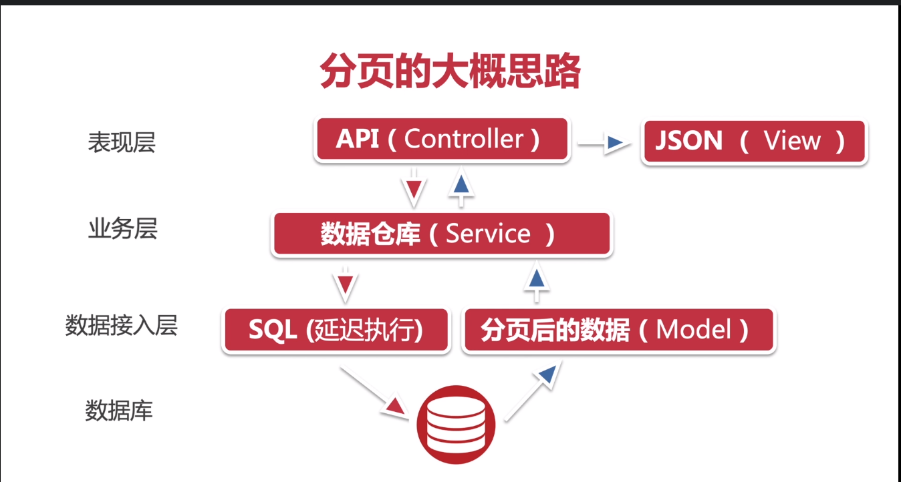

# 使用Docker

1.   拉取镜像

   ```
   docker pull mcr.microsoft.com/mssql/server
   ```

2.  启动镜像

   ```
   docker run -e "ACCEPT_EULA=Y" -e "SA_PASSWORD=PaSSword12!" -p 1433:1433 -d mcr.microsoft.com/mssql/server
   ```

   

# Nuget 包

1.  Microsoft.EntityFrameworkCore
2.  Microsoft.EntityFrameworkCore.SqlServer
3.  Microsoft.EntityFrameworkCore.Tools  


# Database Migration

数据迁移

1. ```
   add-migration initialMigration
   ```

更新数据库

1. ```
   update-database 
   ```

   

   ## 命令行使用 dotnet tool install --global dotnet-ef

   1. ```
      dotnet ef  migrations add dataseeding
      ```

      

   2. ```
      dotnet ef  database update
      ```

      

   

# Docker使用Mysql

1.  拉取mysql镜像

   ```
   docker pull mysql:latest
   ```

2. 运行mysql

   ```
   docker run -itd --name mysql-test -p 3306:3306 -e MYSQL_ROOT_PASSWORD=123456 mysql (镜像名称)
   ```

3. 安装Mysql扩展包工具： Pomelo.EntityFrameworkCore.Mysql 

   **注意**：不要使用Oracle官方自带的工具，据说很烂

4.  StartUp.cs  替换为使用Mysql

#  Mysql数据迁移

```
1.	dotnet ef migrations add MysqlInit
2.  dotnet ef database update
```


# AutoMapper  

1.  AutoMapper.Extensions.Microsoft.DependencyInjection

2.  注入IOC容器  

   ```
   services.AddAutoMapper(AppDomain.CurrentDomain.GetAssemblies());
   ```

3.  映射

   ```
    var touristRouteDto = _mapper.Map<TouristRouteDto>(routes)
   ```

4.  类似的框架

   AutoMapper   **VS**  EmitMapper  **VS**  ValueInjecter  **VS**  GraphQL 

# 数据验证规则

1. 尽量不要放在数据模型里验证，操作数据库时可能引发问题，应该放在DTO文件中。


# 自定义数据验证

1.   IValidatableObject 可实现自定义的数据验证规则，例：多个属性捆绑验证：

   ```c#
           public IEnumerable<ValidationResult> Validate(ValidationContext validationContext)
           {
               if (Title == Description)
               {
                   yield return new ValidationResult("Title cannot equals Description",
                   new[] { nameof(TouristRouteForCreationDto) });
               }
           }
   ```


# 类级别的数据验证

1.  建类	

   ```
       public class TouristRouteTitleMustDifferWithDescriptionAttribute : ValidationAttribute
       {
           protected override ValidationResult IsValid(object value, ValidationContext validationContext)
           {
               var touristRouteDto = validationContext.ObjectInstance as TouristRouteForCreationDto;
               
               if (touristRouteDto.Title == touristRouteDto.Description)
               {
                   return new ValidationResult("Title cannot equals Description class", new[] { nameof(TouristRouteForCreationDto) });
               }
   
               return ValidationResult.Success;
           }
       }
   ```

   

2.  使用

   ```
   [TouristRouteTitleMustDifferWithDescription]
   public class TouristRouteForCreationDto{}
   ```


# 返回正确的响应码

1.  400 转化成422 ， Startup.cs   =》  ConfigureServices 

   ```
               services.AddControllers()
               // 验证数据是否非法
               .ConfigureApiBehaviorOptions(setupAction =>
               {
                   setupAction.InvalidModelStateResponseFactory = context =>
                   {
                       var problemDetail = new ValidationProblemDetails(context.ModelState)
                       {
                           Type = "都行",
                           Title = "数据验证失败",
                           Status = StatusCodes.Status422UnprocessableEntity,
                           Detail = "请看详细说明",
                           Instance = context.HttpContext.Request.Path
                       };
                       problemDetail.Extensions.Add("traceId", context.HttpContext.TraceIdentifier);
                       return new UnprocessableEntityObjectResult(problemDetail)
                       {
                           ContentTypes = { "application/problem+json" }
                       };
                   };
               });
   ```


# 更新部分数据

1.   Nuget:  Microsoft.AspNetCore.JsonPatch

2.  Nuget : Microsoft.AspNetCore.Mvc.NewtonsoftJson

3.  注册服务

   ```
               .AddNewtonsoftJson(setupAction =>
               {
                   // 配置框架
                   setupAction.SerializerSettings.ContractResolver = new 				   	  CamelCasePropertyNamesContractResolver();
               })
   ```

    

# PATCH请求的数据验证

1.  

   ```
              patchDocument.ApplyTo(touristRouteToPatch, ModelState);
   
               if (!TryValidateModel(touristRouteToPatch))
               {
                   return ValidationProblem(ModelState);
               }
   
   ```


# JWT身份验证

1.  Nuget  : Microsoft.AspNetCore.Authentication.JwtBearer
2.  参照Login部分（生成token）


# 启动API授权

1.  注册身份认证服务

   ```
   services.AddAuthentication(JwtBearerDefaults.AuthenticationScheme)
                   .AddJwtBearer(options =>
                   {
                       var secretByte = Encoding.UTF8.GetBytes(Configuration["Authentication:SecretKey"]);
                       options.TokenValidationParameters = new TokenValidationParameters()
                       {
                           // 验证token的发布者 (只有此Issuer发布的token才会被接受)
                           ValidateIssuer = true,
                           ValidIssuer = Configuration["Authentication:Issuer"],
   
                           ValidateAudience = true,
                           ValidAudience = Configuration["Authentication:Audience"],
   
                           ValidateLifetime = true,
   
                           IssuerSigningKey = new SymmetricSecurityKey(secretByte)
                       };
                   });
   ```

   

2.  服务框架的启动

   ```
               app.UseRouting();
   			// 注意启动的位置
               app.UseAuthentication();
               app.UseAuthorization();
   ```

   

3.  在需要设置权限的ActionResult上增加特性[Authorize]

## 添加用户角色

1.   在生成Token的Claims里添加以下代码

   ```
                   new Claim(ClaimTypes.Role, "Admin")
   ```

   

2.  修改特性为         [Authorize(Roles = "Admin")]


# 用户模型设计与数据库更新

1.  ​	Nuget :  Microsoft.AspNetCore.Identity.EntityFrameworkCore
2.  ​    public class AppDbContext : IdentityDbContext<IdentityUser> //DbContext
3.  ​    添加服务依赖

```
  services.AddIdentity<IdentityUser, IdentityRole>()
                .AddEntityFrameworkStores<AppDbContext>();
```

4.  build后，迁移数据

# Note

​	  [Authorize(AuthenticationSchemes = "Bearer")]


# 定制用户模型并添加初始化用户数据

1.  自定义 ApplicationUser 继承 IdentityUser

2.  替换相关的IdentityUser为ApplicationUser, Migrations中不替换

   

# LineItem的定义

https://docs.microsoft.com/zh-cn/previous-versions/commerce-server/aa153541(v=cs.90)


# 订单的有限状态


1.  使用Stateless框架实现订单状态机  Nuget: Stateless

2.  Order model中加入 并初始化 

   ```
    StateMachine<OrderStateEnum, OrderStateTriggerEnum> _machine;
    
    private void StateMachineInit()
   {
       _machine = new StateMachine<OrderStateEnum, OrderStateTriggerEnum>(OrderStateEnum.Pending);
   
       #region 配置状态转化
   
       _machine.Configure(OrderStateEnum.Pending)
           // 如果传入的状态为支付，则下一个动作为 ‘支付处理中’
           .Permit(OrderStateTriggerEnum.PlaceOrder, OrderStateEnum.Processing)
           // 
           .Permit(OrderStateTriggerEnum.Cancel, OrderStateEnum.Cancelled);
   
       _machine.Configure(OrderStateEnum.Processing)
           .Permit(OrderStateTriggerEnum.Approve, OrderStateEnum.Completed)
           .Permit(OrderStateTriggerEnum.Reject, OrderStateEnum.Declined);
   
       _machine.Configure(OrderStateEnum.Declined)
           .Permit(OrderStateTriggerEnum.PlaceOrder, OrderStateEnum.Processing);
   
       _machine.Configure(OrderStateEnum.Completed)
           .Permit(OrderStateTriggerEnum.Return, OrderStateEnum.Refund);
       #endregion
   }
   ```


# 第三方支付

1. ​	完善Order Model中的StateMachine

2. ​    添加Http请求服务

   ```
               services.AddHttpClient();
   ```


# 分层




# 分页导航

1.  改造PaginationList
2.  创建分页导航URL
3.   注入服务             services.AddSingleton<IActionContextAccessor, ActionContextAccessor>();


# 15. 数据排序

1.  nuget :   System.Linq.Dynamic.Core
1.  创建属性（PropertyMappingService）映射服务
1.  注册属性依赖服务
1.  映射字典

 
